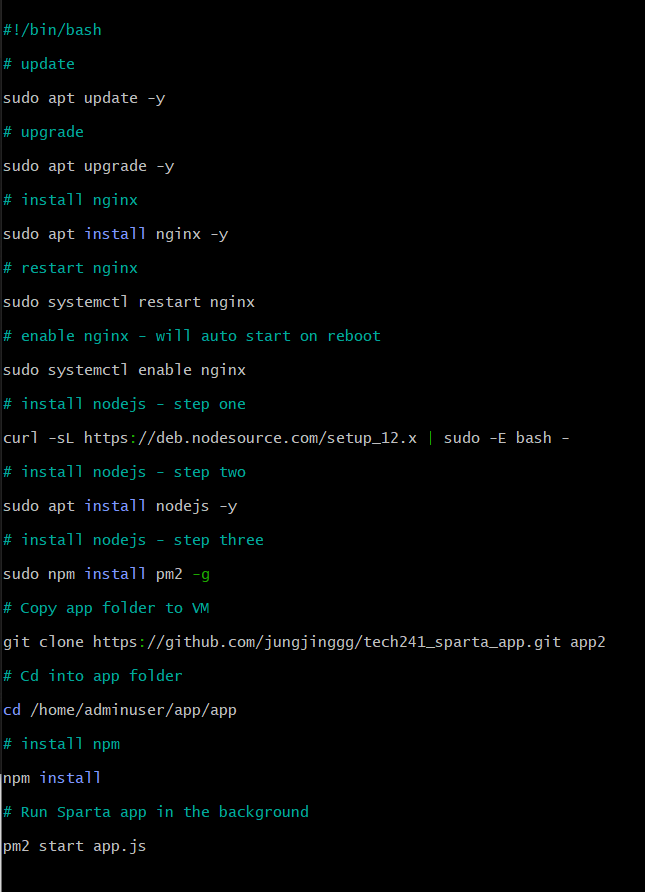
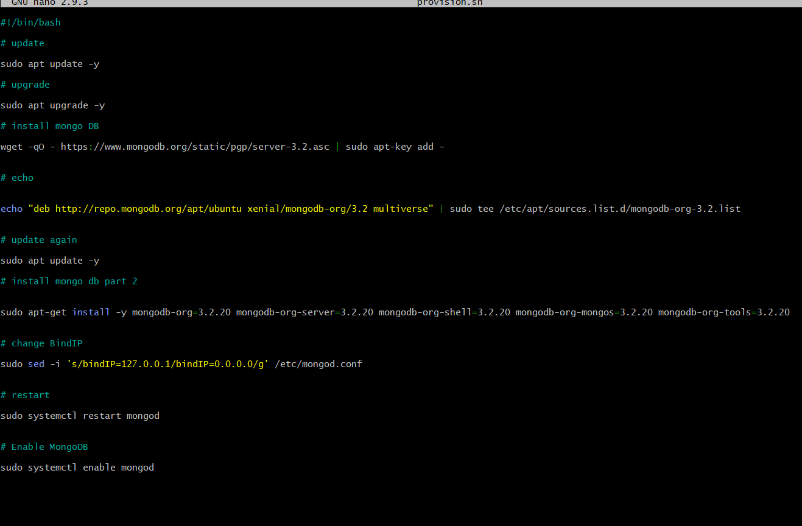

# Automating - Script for Virtual Machine

#!/bin/bash

## Step 1.  Update

    sudo apt update -y

*The update command, fetches the latest package information from repositories, allowing you to see what updates are available for your system. However, it does **not** install the updates. Instead, it updates the local package lists or metadata, which contain information about available packages and their versions.*

*'sudo' is a command that grants administrative or superuser privileges, allowing the following command to be executed with elevated permissions.*

## Step 2. - Upgrade

    sudo apt upgrade -y

*You run sudo apt-get upgrade to install available upgrades of all packages currently installed on the system from the sources configured via sources. list file. New packages will be installed if required to satisfy dependencies, but existing packages will never be removed*.

*Some applications may depend on specific versions of packages, and upgrading those packages could potentially cause compatibility issues, leading to the application not functioning properly. Make sure to check any app dependencies before upgrading.*

## Step 3.  Install nginx

    sudo apt install nginx -y

*NGINX is a fast and lightweight open-source web server and reverse proxy server. It efficiently handles concurrent connections and is commonly used to serve static files, handle dynamic content, and distribute web traffic across multiple servers. With features like SSL termination, caching, and HTTP/2 support, NGINX is popular for improving performance and scalability of web applications*

*NGINX is like a traffic controller for websites and applications. It helps manage the flow of information between users and the servers hosting websites. With its speed and reliability, NGINX ensures websites load quickly and can handle many visitors at once. It plays a vital role in delivering a smooth and enjoyable experience for website users.*

## Step 4.  Restart nginx

    sudo systemctl restart nginx

*When you run this command, it stops the NGINX service if it's currently running and starts it again from scratch. This can be useful in situations where you've made changes to the NGINX configuration or if you're experiencing any issues with the server.*

## Step 5.  enable nginx - will auto start on reboot

    sudo systemctl enable nginx

*Enabling NGINX refers to the action of starting or activating the NGINX web server. When you enable NGINX, you initiate the process of running the server, allowing it to handle incoming requests and serve web content. This will also start NGNIX on reboot alongside other system processess*

## Step 6.  Install nodejs - part a

    curl -sL https://deb.nodesource.com/setup_12.x | sudo -E bash -

*The **curl** commands allows us to transfer the data required to install node.js*

*Node.js is an open-source JavaScript runtime environment that allows developers to run JavaScript code on the server-side. Unlike traditional JavaScript, which primarily runs in web browsers, Node.js enables the execution of JavaScript code on servers, enabling the development of server-side applications.*

## Step 7.  Install nodejs - part b

    sudo apt install nodejs -y

## Step 8.  Install nodejs - part c

    sudo npm install pm2 -g

* *'npm' is the package manager for Node.js, used to manage and install JavaScript packages.*

* *'install' is an npm command that installs packages.*

* *'pm2' is a specific package name, referring to PM2 (Process Manager 2), which is a popular process manager for Node.js applications.*

* *'-g' is an npm flag that indicates the package should be installed globally, making it accessible from any directory in the system.*

## Step 9.  Copy app folder to VM

    git clone https://github.com/jungjinggg/tech241_sparta_app.git app2

## Step 10.  Cd into app folder

    cd /home/adminuser/app/app

## Step 11.  Install npm

    npm install

## Step 12.  Run Sparta app in the background

    pm2 start app.js

# Automating - Script for Database

