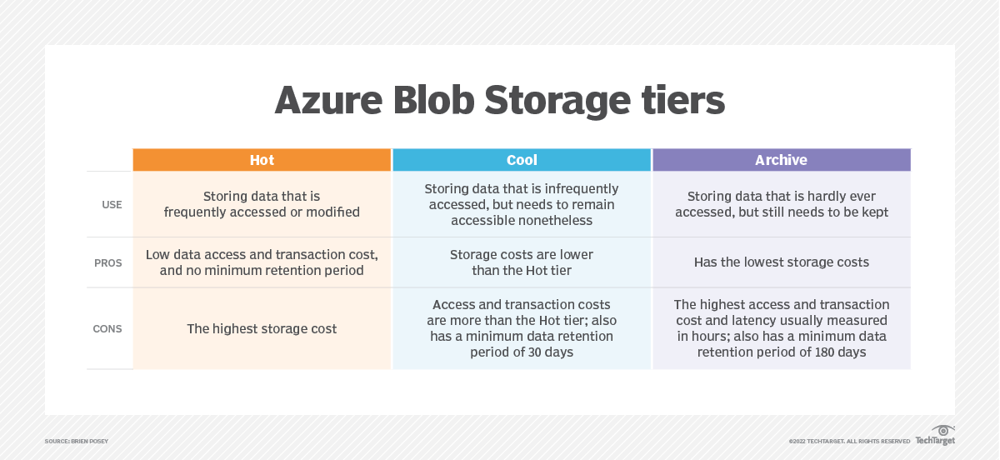
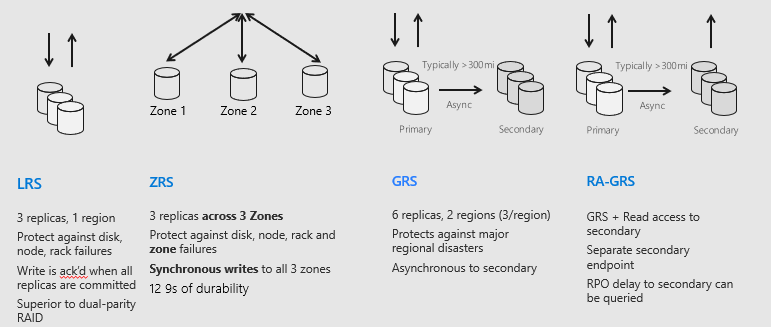

# <u>**Blob Storage**</u>

**What is blob storage?**

Blob storage in Azure is a cloud-based storage service that allows you to store and manage large amounts of unstructured data, such as text files, images, videos, and other binary objects. It's like a virtual container where you can store your files.

**Advantages of Blob Storage:**

Scalability: Blob storage provides virtually unlimited scalability, allowing you to store and manage large amounts of data without worrying about storage capacity constraints. It can easily handle terabytes or even petabytes of data.

Cost-effective: Blob storage is typically cost-effective, especially for long-term storage or archival purposes. Cloud providers often offer pricing models based on the amount of storage used, making it affordable for businesses of all sizes.

Durability and Redundancy: Blob storage is designed to provide high durability and data redundancy. Cloud providers replicate data across multiple physical locations, ensuring that your data is protected against hardware failures or disasters. This makes blob storage a reliable choice for data backup and disaster recovery scenarios.

Accessibility: Blob storage can be accessed from anywhere via the internet. Cloud providers offer APIs and client libraries that allow easy integration with applications, making it convenient for developers to retrieve and store data.

Flexibility: Blob storage accommodates a wide variety of data types, such as files, images, videos, and unstructured data. It does not enforce specific file structures or schemas, providing flexibility for storing diverse data formats.

**Disadvantages of Blob Storage:**

Limited File System Operations: Blob storage is optimized for large-scale data storage but lacks some traditional file system operations and features. For example, it may not support advanced file-level operations like random access or updating specific parts of a file. It may also lack certain file system attributes like file permissions or metadata.

Latency: Accessing data from blob storage over the internet introduces network latency compared to local file systems. This latency can affect real-time or high-performance applications that require instant data retrieval.

Learning Curve: Implementing and managing blob storage may require a learning curve, especially if you are new to cloud services or the specific cloud provider's ecosystem. It may involve understanding and configuring storage accounts, access controls, and integration with other cloud services.

Internet Dependency: Since blob storage is a cloud-based service, it relies on an internet connection for data access. If there are connectivity issues or interruptions, it may impact the availability and accessibility of the stored data.

**What is the difference between blob storage and the file system of Linux/Windows/Mac (hierachical file storage)?**

**Blob Storage:**

Blob storage is a type of storage service provided by cloud platforms like Azure or Amazon Web Services (AWS). It is designed to store large amounts of unstructured data, such as files, images, videos, or backups. Blob storage organizes data into containers or buckets, and each piece of data is called a blob. Blobs are typically accessed via unique URLs or APIs. Blob storage offers features like scalability, durability, and availability, making it suitable for cloud-based applications and data storage.

**File System (Linux/Windows/Mac):**

The file system used in operating systems like Linux, Windows, and macOS follows a hierarchical structure. It organizes data in a tree-like format, with a root directory at the top and various subdirectories and files within it. Users can create folders (directories) and store files in those directories. The file system allows you to navigate through directories and access files using paths (e.g., /home/user/documents/file.txt). It provides features like file permissions, file metadata, and supports a wide range of file operations (create, read, write, delete, etc.).

**Difference in Blob storage tiers**

**How do parts of Azure blob storage: account, container, blobs - relate?**

**Differences between block blob storages**

# *Steps to create blob storage*

**<u>To create a storage account</u>**

az storage account create --name tech241shireenstorage --resource-group tech241 --location uksouth --sku Standard_LRS

(Can't have hyphens in the name of storage account)

**<u>To view storage accounts</u>**

az storage account list --resource-group tech241

**Another way to view**

az storage account list --resource-group tech241 --query "[].{Name:name, Location:location, Kind:kind}" --output table

**<u>To create a container</u>**

az storage container create \ --account-name tech241shireenstorage \ --name testcontainer

Get rid of the back slash - only put them in if it needs to go onto another line

**<u>To upload a blob</u>**

az storage blob upload --account-name tech241shireenstorage --container-name testcontainer --name newname.txt --file test.txt --auth-mode login

**<u>To get storage list</u>**

az storage blob list --account-name tech241shireenstorage --container-name testcontainer --output table --auth-mode login

*(Remember to change values accordingly)*
