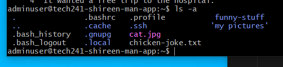
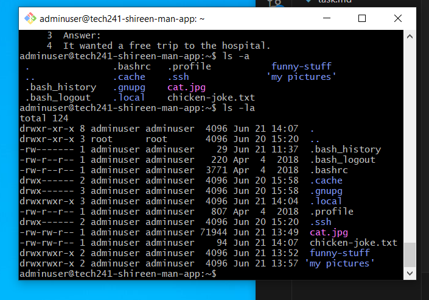

# <u> **Linux and Scripts** </u>

## <u>**Why Linux?**</u>

* Free -Open source - inexpensive

* Flexible operating system

* Stable and secure operating system

* Scales well - can perform many tasks.

* Can run linux on many devices - cut down versions avaliable.

* Becoming more popular for work stations.

* Often used in dev-ops. - Makes you more employable if you have a good knowledge of Linux.

**Linux is comprised of:**

* Kernel: Core operating system

* Numerous libraries and utilities that rely on the kernel

* There are multiple distributions of Linux available

* Ubuntu is the distribution currently being used

## **<u>Commands**</u>

To check operating system on gitbash - once logged into VN

Type **uname**

This will give you commands you need.

**uname --help**


for instance processor - you can do uname -p or uname --processor

**uname -n**

(will give us host name - node name)

To find all details -a

**uname -a**

(will give us all information)

**whoami** - will also give information 

## <u>**Why do linux commands work on gitbash?**</u>

* Git Bash: It is a tool that installs a special environment and understands Linux commands.

* Git Bash allows the translation of Linux commands into the local machine or virtual machine.

* Git Bash runs a version of GNU on Windows.
Not all Linux commands will work on Git Bash while using Windows.
Once logged in, all Linux commands are available.

* While it is possible to use the command prompt to sign in, Git Bash is preferred.
Linux commands do not work in Windows.

* Command Prompt: It is for Windows.


## <u>**What is bash?**</u>


1. Bash stands for Bourne Again SHell.
   
2. It is a command-line shell and scripting language.
   
3. Default shell for Unix-based operating systems like Linux and macOS.
   
4. Provides a text-based interface for interacting with the operating system.
   
5. Allows executing commands to navigate directories, run programs, manipulate files and folders, and manage system settings.
   
6. Supports scripting, enabling the creation of Bash scripts to automate tasks and perform complex operations.
   
7. Bash scripts are files containing a series of commands executed together.
   
8. Powerful tool for system administration, task automation, and small program development.


## <u>**What is a shell?**</u>


1. Software which provides an interface to run the commands.

2. A shell acts as a mediator between the user and the operating system.
   
3. It accepts commands from the user, interprets them, and communicates with the operating system to execute those commands.
   
4. The user inputs commands into the shell by typing them as text.
   
5. The shell then processes these commands and performs the requested actions, such as running programs, manipulating files, or configuring system settings.
   
6. Shells provide features like command history, command completion (auto-suggesting commands), and the ability to run commands in the background.
   
7. They often have built-in programming features, such as variables, loops, conditionals, and functions, allowing users to write scripts or automate tasks.
   
8. Shells come in different platforms, with popular ones including Bash (Bourne Again SHell), PowerShell, and Zsh.


## **<u>Navigating files and folders** </u>


````
cat command - to print out files 

ps -p <- to specify the shell you are running and process you are running.

history <- will show you list of all commands you have used

To run a command in history - find the number of the command and press !2 (number of command you need)

history --help <- This will show you more information on commands if you need help.

ls <- shows files

ls -a <- shows hidden files



. <- current directory
.. <- parent directory

cd .. <- will take yo to your parent directory

cd or cd ~ <- will take you to your home directory

Not every user gets their own user folder in the home directory.

root user-super user has a special folder in the root/parent directory.

pwd <- present working directory

ls -l <- allows you to view permissions on files

ls -la <- allows you to view permission on hidden files



(In the image - blue are directories and start with d)

Linux doesn't care about file extensions. It can recognise the type of file.

curl <- transfers data 

So in order to add a jpg - curl url

You need to print file to a specific output

curl url --output filename <- will add the jpg to the file

commands are case-sensitive!

mv filenameyouwanttochange newfilename -< This will rename the file

file nameoffile <- will tell you type of file

cp nameoffile nameofnewfile <- will copy the file

rm nameoffile <- removes file *Be careful with this command*

mkdir nameofdirectory <- creates a directory/folder

Do not use spaces in files and folders - if you have to - use "name of file" or 'name of file' or \

rm -r nameofdirectory <- This will delete all directory and files within the folder *Be careful with this command*

touch nameoffile <- will create an empty file

nano nameoffile <- Will allow you to edit your file and add content to it - press ctrl + s to save it and then ctrl + x

cat nameoffile <- to view/print file on screen

head -2 nameoffile <- Will give first two lines of the file

tail -2 nameoffile <- will give you last two lines of the file

nl nameoffile <- will number your file

Piping

cat chicken-joke.txt | grep nameyouwanttosearch <- this can search a file and highlight it - screenshot image

apt-get install or apt install <- this is what you use to install packages on linux machine

sudo apt install

tree - way to see file structure (only relative to where you are) - Shows you evening dwon from where you are.

(Note: sometimes when installing with sudo - you might get error - cannot locate a package - needs to know abot it - needs to be in source list you may need to run a command to help locate source list)

sudo apt update -y or sudo apt-get -y

To get to root directory - cd / <- / represents root directory

To get to home directory - cd adminuser/

~ represents home directory

Quicker way to get to home folder from root directory - cd or cd ~

cd / bin <- will take you to the root directory and then bin folder

To create a folder - mkdir nameofdirectory


````

## **<u>Public IP Address (associated with VM)**</u>

Static: It remains the same and is linked to your VM. You don't need to change the SSH key even when the VM is restarted. This is the default behavior on Azure.

Dynamic: This is the default on AWS. The IP address changes every time the VM is restarted and is not suitable for production servers.

## **<u>Variables**</u>

Setting a variable: MYNAME=SHIREEN

Retrieving the value of a variable: $MYNAME

**<u>Environment Variable**</u>

A value stored in memory accessible by other tools in Linux, including the operating system.

Use printenv to display environment variables.

Environmental variables remain accessible to other processes.

Setting an environment variable: export MYNAME=SHIREEN

Retrieving the value of an environment variable: printenv MYNAME

Conventionally, environment variables are written in uppercase.

Useful for scripting purposes.

To remove an environment variable: unset nameofvariable

Persistent Environment Variable:

Purpose: To have the variable available every time you log in.

Edit .bashrc file to add persistent environment variables.

Other configuration files can also load environmental variables, allowing all users to access them.

If changes are made in the current directory, reload the file: source .bashrc

Creating/Running Scripts:

Running a script: If the script is in the current directory, execute it accordingly.

## **<u>Processes</u>**

A program loaded in RAM that may use CPU power.

Two types: system processes (ps aux shows all, not just system) and user processes (ps).

Each process has a Process ID (PID).

Every process needs to be started by something or someone.


## **<u>Killing Processes**</u>


* Gentle way: Use **kill -1 processid**

* Can use **kill processid** - Same as kill -15

* Brute Force: Use "**kill -9 processid**" to forcefully terminate a process. However, this can result in child processes being cut off from their parent and turning into zombie processes.

* To check for any zombie processes running in the background, use "ps aux".

* To see parent processes, use "ps -ef". This command displays the parent processes if needed.

## **<u>What we need to run the sparta app?</u>**

Requirements:

1. Linux VM - Ubuntu 18.04 LTS
2. Web server - Nginx
3. Right version node js - version 12.x (not higher wont work) - called dependencies - App depends on this. All the things to be installed, running and configured for your app to run.
4. App folder 
5. Inside of app folder - need to be able to cd into this - and need to be able to run two commands 
    1) npm install ( node package manager ) - this will install the code
    2) node app.js OR npm start


## **<u>Moving folder to VM - Github</u>** 
Whatever method you use - make sure to unzip the folder!
  
1) Create a gitrepo - Tech241-Sparta-app
2) Create a folder "Tech241-Sparta-app" on your local machine
3) Copy your app folder to local repo
4) Sync to remote repo on github
5) SSH into your VM and git clone

Example - git clone https://github.com/jungjinggg/tech241_sparta_app.git app

