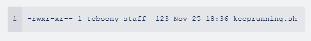

**Task 2.8A**


**Why is managing file ownership important?**

File ownership determines who can access and modify a file or folder.

When you create a file or folder, your user account becomes the owner by default.

Ownership allows you to control permissions and transfer ownership to others.

File ownership is crucial in collaborative environments where multiple people need access to specific documents.


**What is the command to view file ownership?**

The command to view file ownership is ls-l

**What permissions are set when a user creates a file or directory?**

When you create new files on Linux, they are initially set with permissions of rw-rw-r– by default. This means that you have read and write permissions for the file, as well as the ability to read the file's contents. Other users in the same group also have the same permissions, while users outside the group have only read access.

**Who does file or directory belong to?**

The file or directory belongs to the one who creates the file/directory.

**Why does the owner, by default, not receive X permissions when they create a file?**

The owner of a file does not receive execute (X) permissions when they create a file.

This is done for security reasons and follows the principle of least privilege.

The goal is to limit the permissions granted to users to minimize potential risks.

Not granting execute permissions to the owner by default prevents accidental execution of potentially harmful or malicious files.

The owner can explicitly grant the execute permission using the chmod command if the file is intended to be executable.

This ensures that the owner consciously decides to make the file executable and reduces the risk of accidentally executing a file with unintended consequences.

**What command is used to change the owner of a file or directory?**

The chown command is used.

To change the owner of a file use the chown command followed by the user name of the new owner and the target file as an argument


**Task 2.8B**

Does being the owner of a file mean you have full permissions on that file? Explain.

Being the owner of a file on Linux doesn't automatically mean you have complete permissions.

Ownership grants control over the file and the ability to change permissions, transfer ownership, or delete the file.

Permissions, categorized as read, write, and execute, determine what actions can be taken on the file, regardless of ownership.

While owners can modify permissions, they still need to follow the actual permissions set on the file.

The specific actions an owner can perform on a file depend on their assigned permissions.
Ownership provides control, but actual permissions define file access and operations.

Owner gets r, w and execute when they create a directory and read adn write for files created.

**If you give permissions to the User entity, what does this mean?**

If you give permissions to the User entity, it means that you are granting specific rights and access to an individual user account on a system or a file.

**If you give permissions to the Group entity, what does this mean?**

Giving permissions to the Group entity means assigning specific privileges to all users who belong to that particular group.
The permissions may include read, write, execute, or other custom-defined access levels.

**If you give permissions to the Other entity, what does this mean?**

If you give permissions to the Other entity, it means that you are granting specific rights and access to all other users who are not the owner or part of the group associated with a file or directory.

**You give the following permissions to a file: User permissions are read-only, Group permissions are read and write, Other permissions are read, write and execute. You are logged in as the user which is owner of the file. What permissions will you have on this file? Explain.**

Read: You will be able to view the contents of the file.

Write: You will be able to modify the file, such as adding or deleting content, but you won't be able to save those changes.

Execute: You won't have execute permissions, which means you cannot run the file as a program or script.

To summarize, as the owner of the file, you will have read-only permissions, allowing you to view the file's content, but not make any changes. The absence of execute permissions means you cannot execute the file as a program or script.

**Here is one line from the ls -l. Work everything you can about permissions on this file or directory.**



The first set of permissions applies to the owner of the file. The second set of permissions applies to the user group that owns the file. The third set of permissions is generally referred to as "others."

Owner can read and write the file.

User Group can execute and read the file.

Others can execute and read the file.

**Task 2.8C**

**What numeric values are assigned to each permission?**

r (read): 4
w (write): 2
x (execute): 1


**What can you with the values assign read + write permissions?**

Read (r)
Read permission is used to access the file's contents. You can use a tool like cat or less on the file to display the file contents. You could also use a text editor like Vi or view on the file to display the contents of the file. Read permission is required to make copies of a file, because you need to access the file's contents to make a duplicate of it.

Write (w)
Write permission allows you to modify or change the contents of a file. Write permission also allows you to use the redirect or append operators in the shell (> or >>) to change the contents of a file. Without write permission, changes to the file's contents are not permitted.

**What value would assign read, write and execute permissions?**

4, 2 and 1

**What value would assign read and execute permissions?**

4 and 1

**Often, a file or directory's mode/permissions are represented by 3 numbers. What do you think 644 would mean?**

The first digit (6): Represents the permissions for the owner of the file.
The second digit (4): Represents the permissions for the group associated with the file.
The third digit (4): Represents the permissions for other users, i.e., users not in the owner's group.

**Task 2.8D**

**What command changes file permissions?**

First one is changing files in the numeric mode.
Second is the symbolic mode where you put enter user class and the permissions you want to grant them.

```
$ chmod 744
$ chmod ug+rwx example.txt
$ chmod o+r example2.txt
```

The u - represents permissions for the user owner

The g - represents other users in the files group

The o - represents other users not in the files group

r - read

w - write

e - execute

Plus sign to add
Minus sign to remove

**To change permissions on a file what must the end user be? (2 answers)**

Only owner and admin can change permissions on the file.

Owner of the file can use chwown or chgrp to change the ownership of a file.


**Give examples of some different ways/syntaxes to set permissions on a new file (named testfile.txt) to:**

```
chmod ug+rwx testfile.txt
```

```
chmod 744 testfile.txt
 ```

chmod ug-rwx testfile.text - will grant owner read, write and execute to owner and group.

Chmod 744 - will grant read, write and execute permissions for owner and read permission for group.


**Set User to read, Group to read + write + execute, and Other to read and write only**

```
chmod u=r,g=rwe,o=rw testfile.txt

```

**Add execute permissions (to all entities)**

```
chmod ugo=e textfile.txt
```

**Take write permissions away from Group**

```
chmod g-w testfile.txt
```


**Use numeric values to give read + write access to User, read access to Group, and no access to Other.**

```
chmod 640 testfile.txt
```

**Octal values**

The first digit is for owner permissons
The second digit is for group permissions.
The third digit is for other users.

r - 4 (read)
w - 2 (write)
x - 1 (execute)

Extra resources used:

https://developers.redhat.com/cheat-sheets/linux-commands-cheat-sheet-old?intcmp=701f20000012ngPAAQ

https://www.redhat.com/sysadmin/linux-file-permissions-explained